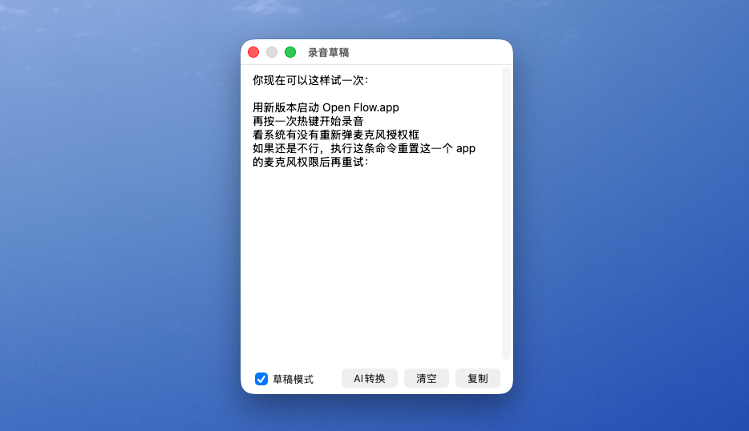
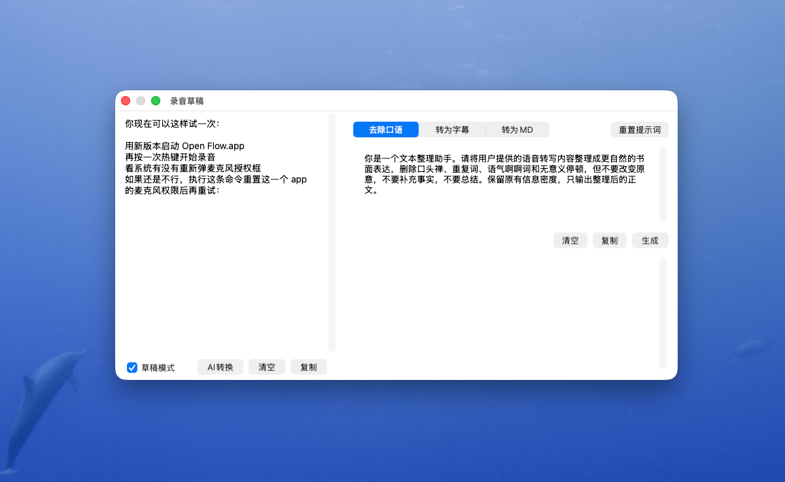
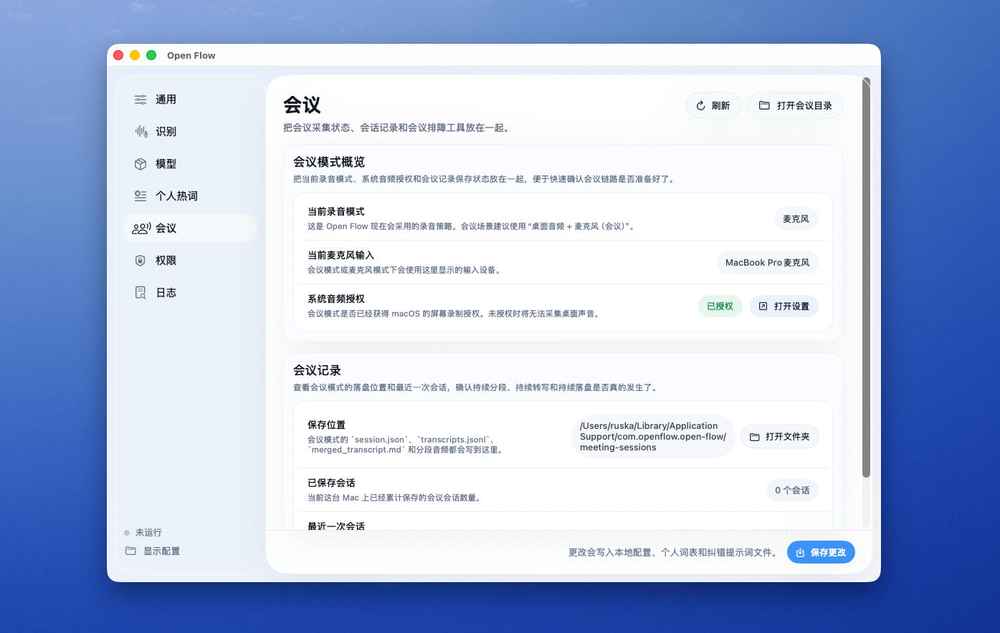
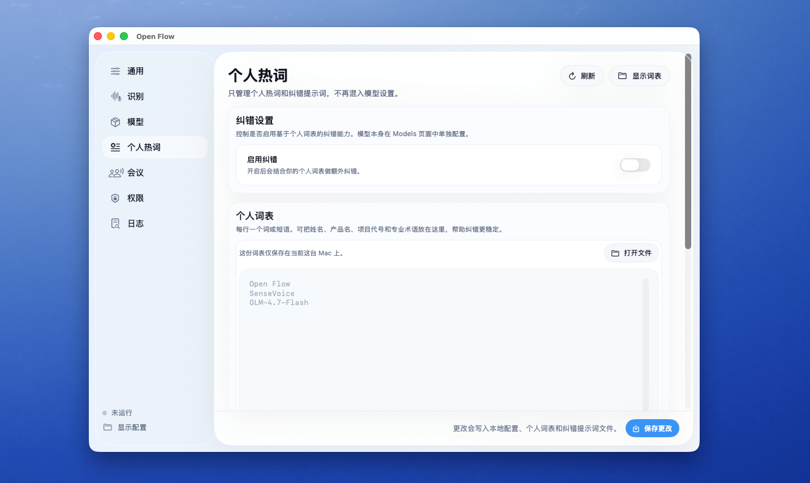
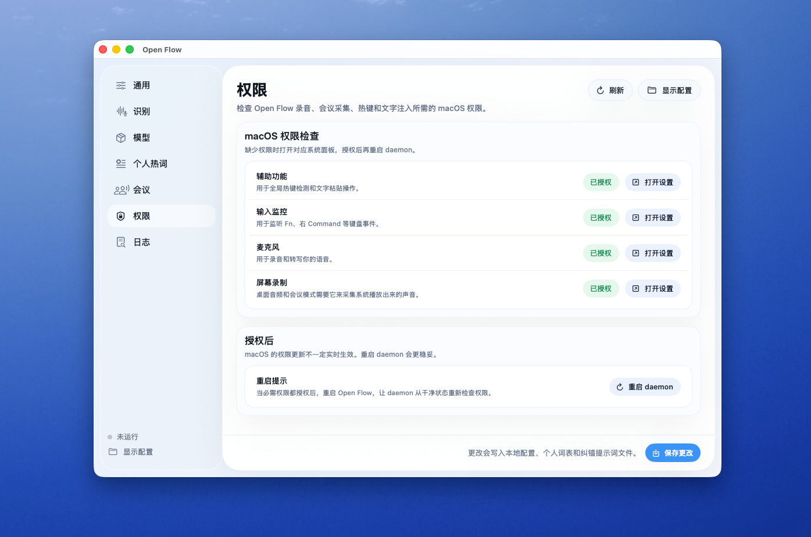
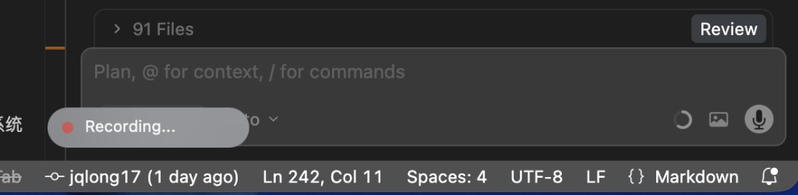
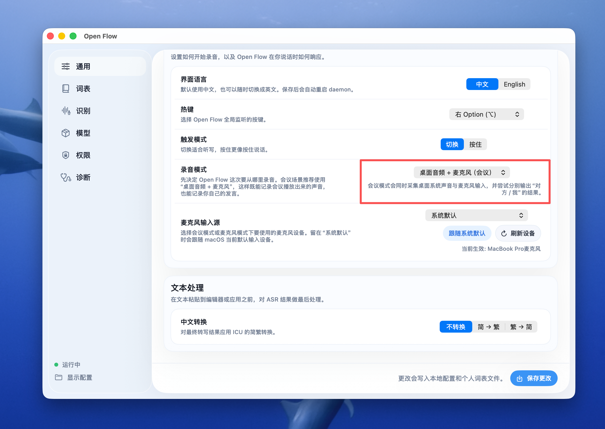
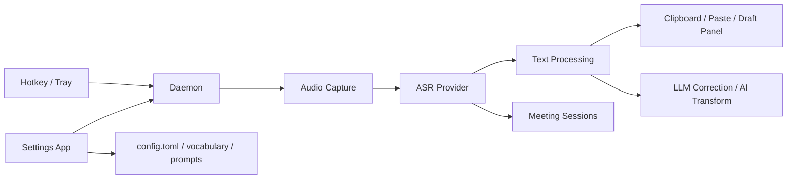

# Open Flow

**简体** | [繁體](README.zh-TW.md) | [English](README.en.md)


**面向 AI 编程场景的开源语音输入工具。** 按一下键录音，再按一下转写并粘贴。

[](https://star-history.com/#jqlong17/open-flow&Date)

---

## 用户使用

### 产品概述

Open Flow 是一个围绕「**热键 -> 录音 -> 转写 -> 自动输出文本**」打造的开源语音输入工具，适合在 Cursor、VS Code、终端、浏览器和各类编辑器中替代部分键盘输入。

它同时覆盖三类常见场景：

- **即时语音输入**：按下热键开始录音，再按一次结束并输出文本
- **会议记录**：同时采集系统声音和麦克风输入，持续分段转写并落盘
- **草稿整理**：在录音草稿中继续用 AI 做口语清洗、字幕生成和 Markdown 整理

### 使用方式

#### 录音草稿

录音草稿适合承接“先说出来，再慢慢整理”的工作流。你可以先把转写内容持续写进草稿，再决定是否复制、清空或继续做 AI 整理。



#### 文本转换

文本转换面板内置在草稿右侧，适合把原始转写进一步整理成更适合分享、发布或归档的文本结果。



#### 会议模式

会议模式适合线上会议、课程或演示场景，可查看会话目录、最近一次会议记录和系统声音相关状态。



#### 个人热词

个人热词页面适合维护姓名、产品名、项目代号和行业术语，让转写后的纠错更稳定。



#### 权限设置

权限页会集中展示麦克风、辅助功能、输入监控和屏幕录制状态，方便首次安装和排障时快速检查。



#### 浮动录音指示器（macOS）

录音时会在光标附近显示药丸形浮层，红色圆点 +「Recording…」表示正在录音，转写时显示「转写中…」，不挡鼠标操作。



#### 录音草稿 AI 转换

当你打开 **录音草稿** 后，可以点击底部的 **AI转换**，在草稿右侧展开一个内嵌 AI 面板，直接对当前草稿内容做进一步整理。

当前默认提供 3 个基础转换：

- **去除口语**：删掉语气词、重复词和口头禅，把口语内容整理成更自然的书面表达
- **转为字幕**：将当前草稿整理为标准 `SRT` 字幕格式，默认按文本量自动估算时长
- **转为MD**：把草稿内容整理成结构清晰的 Markdown 笔记

说明：

- 每个转换都带有可编辑的默认提示词，支持本地保存和重置
- 生成结果会显示在右侧面板下半区，可直接 **清空 / 复制 / 重新生成**
- 当前这 3 个只是第一批基础能力，后续还会继续增加更多 AI 转换模板

#### 设置界面（macOS）

从托盘菜单点击 **「偏好设置…」** 可打开图形化设置窗口，无需改 config 文件即可管理以下内容。



| 分页 | 功能 |
|------|------|
| **General** | 热键（右 Command / 右 Option / Fn / F13 等）、触发模式（Toggle / Hold）、**录音模式**（麦克风 / 桌面音频 / 桌面音频 + 麦克风）、麦克风输入源、简繁转换（无 / 简→繁 / 繁→简） |
| **Recognition** | 本地 SenseVoice / Groq Whisper 切换、Groq API Key、Whisper 模型与语言 |
| **Models** | 本地模型状态、下载/重新下载、模型目录路径与 Finder 打开入口，以及 LLM 配置 |
| **Vocabulary** | 个人热词、纠错开关、纠错提示词、智谱 API Key、本地词表文件入口 |
| **Meetings** | 会议模式状态、会话落盘目录与最近一次会议记录 |
| **Permissions** | macOS 权限状态、「打开设置」跳转与重启 daemon 提示 |
| **Logs** | 会议排障、热键监听测试、daemon 日志、模型下载输出 |

新版配置页采用更精致的侧边栏和更紧凑的卡片布局，把原本分散的设置入口统一到了同一套 SwiftUI 面板里。现在录音相关配置也收敛成了更直观的结构：先选 **录音模式**，再在需要时选择 **麦克风输入源**。窗口底部的 **Save Changes** 会同时保存 `config.toml` 与个人词表；权限项会显示是否已授权，模型页也可以直接打开模型所在文件夹。

#### 会议模式（桌面音频 + 麦克风）

如果你希望记录线上会议、课程或演示中的完整对话，推荐在 `General` 页选择 **桌面音频 + 麦克风（会议）**。

- `录音模式` 负责决定整体录音策略
- `麦克风输入源` 只在模式包含麦克风时出现，用于选择你的发言输入设备
- 会议模式会同时采集桌面系统声音与麦克风声音，并尽量按来源输出为“对方 / 我”
- 会议模式支持**持续分段采集、持续分段转写、持续落盘**

会议模式的落盘内容会写入本机 `meeting-sessions/` 目录，包含：

- `session.json`
- `transcripts.jsonl`
- `merged_transcript.md`
- `segments/*.wav`

#### Personal Vocabulary / BigModel 纠错

用途：

- 降低人名、产品名、项目代号、内部术语这类高频专有词被识别错的概率
- 在本地 SenseVoice 或 Groq Whisper 完成转写后，再做一次轻量文本修正
- 不改动录音流程，仍然保持「录音 -> 转写 -> 粘贴」的即时体验

配置位置：

- 托盘菜单 **「偏好设置…」 -> `Vocabulary`**
- 打开 **Enable correction**
- 在 **Model** 中填写或保留默认的 `GLM-4-Flash-250414`
- 在 **API key** 处填写智谱 BigModel API Key；右侧 **`API Keys`** 按钮可直接跳转申请页面
- 在 **Personal Vocabulary** 中按行填写热词，然后点击 **Save Changes**

补充说明：

- 为避免泄露，仓库与发布包**不内置 API Key**，需要用户自行申请并配置
- BigModel API Key 申请页：[https://bigmodel.cn/usercenter/proj-mgmt/apikeys](https://bigmodel.cn/usercenter/proj-mgmt/apikeys)
- `GLM-4-Flash-250414` 是智谱官方文档标注的免费模型，适合先用来体验热词纠错能力：
  [模型文档](https://docs.bigmodel.cn/cn/guide/models/free/glm-4-flash-250414) / [模型概览](https://docs.bigmodel.cn/cn/guide/start/model-overview)
- 关闭 **Enable correction** 时，Open Flow 只使用原始 ASR 结果，不会调用大模型纠错
- 个人词表保存在本机 `~/Library/Application Support/com.openflow.open-flow/personal_vocabulary.txt`

#### macOS 权限设置

Open Flow 需要以下权限才能完整工作。**首次启动后请依次在系统设置中手动开启**：

| 权限 | 路径 | 用途 |
| --- | --- | --- |
| **麦克风** | 隐私与安全性 → 麦克风 | 录制语音 |
| **辅助功能** | 隐私与安全性 → 辅助功能 | 监听全局热键、注入文本 |
| **输入监控** | 隐私与安全性 → 输入监控 | 监听全局热键 |
| **屏幕录制** | 隐私与安全性 → 屏幕录制 | 会议模式采集系统声音 |

> **排查提示**：启动日志会打印权限诊断。若不确定授权是否生效，可在托盘 **「偏好设置…」** 的权限页查看实时状态，或查看日志：
>
> ```bash
> tail -f ~/Library/Application\ Support/com.openflow.open-flow/daemon.log
> ```

#### 自动更新（macOS .app）

从托盘菜单点击 **「检查更新并升级...」**：

1. 应用会在后台检查 GitHub Releases 并下载最新安装包（不影响当前继续使用）
2. 下载完成后，菜单项会变为 **「重启以应用更新」**
3. 点击后会自动退出当前版本、替换 App，并重新打开新版本

如果已经是最新版本，会弹窗提示 **「已是最新版本」**。

### 为什么选 Open Flow

| | Open Flow | Wispr / Typeless / 闪电说 |
| --- | --- | --- |
| **开源** | ✅ MIT，完整代码可审计 | ❌ 闭源 |
| **本地模型** | ✅ 语音不离开本机 | 多为云端 |
| **性能** | ✅ Rust，~5 秒音频约 83ms 转写 | 各异 |
| **可定制** | ✅ 热键、模型、输出方式 | 受限 |

我们相信**只有开源才能让更多人参与**：查看实现、修改行为、接入自己的模型、提交改进。Open Flow 是「热键 → 录音 → 本地转写 → 自动粘贴」的开源实现。

### 核心亮点

| 方向 | 说明 |
| --- | --- |
| **性能** | Rust 实现，M3 Pro 实测约 5 秒音频可在约 83ms 内完成转写，适合常驻后台使用 |
| **开源** | MIT 协议，完整代码可审计、可 fork、可修改，也更适合社区协作维护 |
| **隐私** | SenseVoiceSmall 可完全本地运行，无需云端 API，语音可保留在本机 |
| **可扩展** | 支持热键、模型、词表、会议模式、AI 转换等多种可配置能力 |

### 功能

- 在 Cursor、VS Code、终端、浏览器中用语音代替打字
- 中英混合，自动标点
- 转写结果写入剪贴板并自动粘贴（macOS 可选 CGEvent 模拟打字），可随时再次粘贴
- 菜单栏托盘图标（灰/红/黄），录音时可选**浮动指示器**（光标旁「录音中…」「转写中…」）
- 可配置热键（右 Command / Fn / F13）、触发模式（按一次开关 toggle / 按住录 hold）、**简繁转换**（简→繁 / 繁→简）
- 可选本地 SenseVoice 或 **Groq Whisper** 云端识别；可切换模型预设（quantized / fp16）
- 新增 **Vocabulary 词库页**：集中管理个人热词、纠错模型、智谱 API Key 与本地词表文件
- 可选 **BigModel 轻量纠错**：结合个人热词，对 ASR 输出做二次修正，改善专有名词、产品名与项目代号的识别结果
- 新增 **桌面音频 + 麦克风（会议）** 模式：同时采集系统声音与麦克风输入，输出带“我 / 对方”标签的会议转写结果
- 新增 **持续分段会议转写**：会议模式下会按固定时长持续切段、持续转写，并把中间结果持续落盘，便于长会议复盘
- **录音草稿内置 AI 转换面板**：可在草稿右侧直接做文本整理、字幕生成和 Markdown 整理，不打断当前录音与编辑流程
- **macOS**：托盘菜单「偏好设置…」打开 **SwiftUI 设置界面**，图形化管理热键、词库、识别 Provider、模型、权限与日志
- **macOS**：托盘菜单支持自动更新（后台下载，下载完成后点击重启应用更新）

### 平台支持

| 平台 | 安装方式 | 托盘图标 | 自动粘贴 |
| --- | --- | --- | --- |
| macOS Apple Silicon（M1/M2/M3） | 一键安装 / .app 下载 | ✅ | ✅ osascript |
| macOS Intel | 从源码构建 | ✅ | ✅ osascript |
| Linux（X11） | Releases / 从源码构建 | — | ✅ xdotool |
| Linux（Wayland） | 从源码构建 | — | ✅ wtype |
| Windows | Releases / 从源码构建 | — | 剪贴板（需手动 Ctrl+V） |

### 安装与下载

#### macOS

```bash
# 一键安装（Apple Silicon 预编译包，首次自动下载 ~230MB 模型）
curl -sSL https://raw.githubusercontent.com/jqlong17/open-flow/master/install.sh | sh

# 启动（后台运行，可随时关掉终端）
open-flow start
```

首次运行会从 Hugging Face 按当前预设自动下载模型（默认 quantized）。支持两种预设，**首次使用对应预设时都会自动下载**：

- **quantized**（默认）：~230MB，体积小
- **fp16**：~450MB，更高精度，来自 [ruska1117/SenseVoiceSmall-onnx-fp16](https://huggingface.co/ruska1117/SenseVoiceSmall-onnx-fp16)，需手动切换

切换为高精度：`open-flow model use fp16`（若未下载会先自动拉取）；列出预设：`open-flow model list`。菜单栏灰色圆点即就绪，按右侧 Command 录音，再按一次转写并粘贴。

**或下载 .app**（双击即运行）：前往 [Releases](https://github.com/jqlong17/open-flow/releases) 页面下载最新的 macOS 安装包，解压后将 **Open Flow.app** 拖入「应用程序」。运行后点击菜单栏托盘图标，选择 **「偏好设置…」** 即可打开图形化设置界面（热键、Provider、模型、权限、日志等）。

> **安装提示（macOS）**：如果首次双击时被系统拦截，或提示“无法打开 / 无法安装”，请前往 **系统设置 → 隐私与安全性**，在页面底部点击 **仍要打开**，然后重新启动一次应用。

#### Linux

Linux 版支持 **系统托盘**（通知区域图标显示待机/录音/转写状态，右键可退出；需安装 libappindicator）。可选：一键安装预编译包，或从源码构建。

**一键安装（预编译，x86_64）**

```bash
mkdir -p ~/.local/bin && curl -sSL https://github.com/jqlong17/open-flow/releases/latest/download/open-flow-x86_64-unknown-linux-gnu.tar.gz | tar -xzf - -C ~/.local/bin && chmod +x ~/.local/bin/open-flow && (grep -q '.local/bin' ~/.bashrc 2>/dev/null || echo 'export PATH="$HOME/.local/bin:$PATH"' >> ~/.bashrc) && echo '安装完成。执行 source ~/.bashrc 或重新打开终端，然后运行: open-flow start --foreground'
```

安装后运行 `open-flow start --foreground`，首次会自动下载 ~230MB 模型。热键为 **右侧 Alt 键**；粘贴需安装 xdotool（X11）或 wtype（Wayland）。托盘需安装 libappindicator（见下方从源码构建）。

**从源码构建**（需先安装系统依赖与 Rust）

```bash
# Ubuntu / Debian：系统依赖（含托盘：libappindicator）
sudo apt install libasound2-dev xdotool libappindicator3-dev   # 或 libayatana-appindicator3-dev；X11 粘贴用 xdotool，Wayland 用 wtype

# 安装 Rust（已安装可跳过）
curl --proto '=https' --tlsv1.2 -sSf https://sh.rustup.rs | sh && source ~/.cargo/env

# 克隆并编译
git clone https://github.com/jqlong17/open-flow.git && cd open-flow
cargo build --release
sudo cp target/release/open-flow /usr/local/bin/
```

> **注意**：Linux 上全局热键监听需要读取输入设备权限。如遇权限不足，将当前用户加入 `input` 组：`sudo usermod -aG input $USER`（重新登录后生效）。

#### Windows

Windows 版支持 **系统托盘**（任务栏右侧图标显示待机/录音/转写状态，右键可退出）。转写结果会写入剪贴板，需在目标窗口按 **Ctrl+V** 粘贴。

**一键安装（PowerShell，预编译）**

```powershell
$url = "https://github.com/jqlong17/open-flow/releases/latest/download/open-flow-x86_64-pc-windows-msvc.zip"; $dir = "$env:LOCALAPPDATA\Programs\open-flow"; New-Item -ItemType Directory -Force -Path $dir | Out-Null; Invoke-WebRequest -Uri $url -OutFile "$dir\open-flow.zip" -UseBasicParsing; Expand-Archive -Path "$dir\open-flow.zip" -DestinationPath $dir -Force; Remove-Item "$dir\open-flow.zip"; $path = [Environment]::GetEnvironmentVariable("Path", "User"); if ($path -notlike "*$dir*") { [Environment]::SetEnvironmentVariable("Path", "$path;$dir", "User"); Write-Host "已把 $dir 加入 PATH。" }; $env:Path = [Environment]::GetEnvironmentVariable("Path", "User") + ";" + [Environment]::GetEnvironmentVariable("Path", "Machine"); Write-Host "安装完成。本窗口可直接运行: open-flow.exe start --foreground"
```

安装完成后**当前窗口**即可运行 `open-flow.exe start --foreground`；新开的终端也会自动识别命令。首次运行会自动下载约 230MB 模型。Windows 默认热键为 **右侧 Win 键**（旧配置也会自动兼容）；若需要，也可改成 **右侧 Alt**。转写结果在剪贴板，在任意输入框按 **Ctrl+V** 粘贴。

**Windows / Linux 远程排障建议**

如果启动、热键、录音或音频设备有问题，请优先执行：

```bash
open-flow support
```

或 Windows 上：

```powershell
.\open-flow.exe support
```

它会输出当前可执行文件路径、配置路径、音频输入设备列表，以及 `daemon.log` 的最近日志。把这段输出直接发给维护者，远程排查会快很多。欢迎大家提交 Issue，也欢迎直接提 PR 一起完善 Windows / Linux 体验。

**Windows / Linux 模型下载兜底**

如果默认的 Hugging Face 下载超时，Open Flow 现在会自动依次尝试官方源和 `https://hf-mirror.com`。如果你的网络环境比较特殊，也可以手动指定下载源：

```powershell
$env:OPEN_FLOW_HF_MIRROR = "https://hf-mirror.com"
open-flow.exe setup
```

```powershell
$env:OPEN_FLOW_MODEL_BASE_URL = "https://hf-mirror.com/haixuantao/SenseVoiceSmall-onnx/resolve/main"
open-flow.exe setup
```

```powershell
$env:OPEN_FLOW_MODEL_BASE_URLS = "https://your-mirror.example.com/haixuantao/SenseVoiceSmall-onnx/resolve/main,https://huggingface.co/haixuantao/SenseVoiceSmall-onnx/resolve/main"
open-flow.exe setup
```

如果远程下载仍不稳定，也可以把模型放到自定义目录，然后显式指定：

```powershell
open-flow.exe setup --model-dir D:\open-flow-models\sensevoice-small
open-flow.exe start --foreground --model D:\open-flow-models\sensevoice-small
```

Windows 默认的量化模型目录通常是 `%APPDATA%\openflow\open-flow\data\models\sensevoice-small`。

**从源码构建**（需先安装 [Rust](https://rustup.rs/)）

```powershell
git clone https://github.com/jqlong17/open-flow.git
cd open-flow
cargo build --release
# 二进制在 target\release\open-flow.exe，可加入 PATH 或复制到常用目录
```
---

## 协作开发者

### 架构图

Open Flow 的核心链路可以理解为：



### 主要模块

| 模块 | 说明 |
| --- | --- |
| `src/daemon` | 常驻主流程，协调录音、转写、输出、会议模式和日志 |
| `src/audio` | 麦克风与音频流处理 |
| `src/system_audio` | macOS 系统声音采集相关能力 |
| `src/meeting_notes` | 会议分段、会话目录与合并稿落盘 |
| `src/llm` | 大模型纠错与草稿 AI 转换 |
| `src/draft_panel` | 录音草稿面板 |
| `settings-app` | SwiftUI 设置应用与系统音频 helper |
| `src/common/config.rs` | 配置结构与默认值 |

### 本地开发

**从源码构建**（需 [Rust](https://rustup.rs/)）：

```bash
git clone https://github.com/jqlong17/open-flow.git
cd open-flow
cargo build --release
```

本地前台运行：

```bash
cargo run -- start --foreground
```

本地构建 macOS App：

```bash
./scripts/build-app.sh
```

### 发布与维护

#### 常用脚本

| 脚本 | 作用 |
| --- | --- |
| `scripts/build-app.sh` | 本地构建并安装 macOS App |
| `scripts/release.sh` | 打包并上传 GitHub Release |
| `scripts/setup-notary-profile.sh` | 配置 notarization 所需 profile |

#### macOS 本地打包

```bash
./scripts/build-app.sh
```

会构建 `dist/Open Flow.app` 并安装到 `/Applications/Open Flow.app`。

#### macOS 本地上传 Release 安装包

```bash
./scripts/release.sh
```

如果需要正式的 macOS 发布链路，需先配置 notarization 凭据：

```bash
./scripts/setup-notary-profile.sh
OPEN_FLOW_NOTARY_PROFILE=openflow-notary ./scripts/release.sh
```

如果只是内部分发测试包，也可以临时使用：

```bash
OPEN_FLOW_ALLOW_UNNOTARIZED_RELEASE=1 ./scripts/release.sh
```

但这种包不适合作为正式对外下载版本。

### 开发者专用：性能日志模块

Open Flow 现在包含一套**面向开发调优**的性能日志能力，用来记录语音链路中的关键性能指标，例如：

- 录音时长、样本数、ASR 耗时、LLM 修正耗时、输出耗时、端到端总耗时
- 进程级 CPU / RSS / VSZ 快照
- 空录音、低振幅、ASR 失败等异常路径
- 按 session 持久化保存，便于后续复盘和持续优化

这部分能力的日志落盘本身可以通过配置项启用，但**设置界面里的开发者性能入口默认不会出现在正式构建里**。我们专门把它做成了**编译期开关**，方便协作者本地调试，同时避免误发布给最终用户。

本地开启开发者性能 UI：

```bash
OPENFLOW_PERF_DEV_UI=1 ./scripts/build-app.sh
```

说明：

- `OPENFLOW_PERF_DEV_UI=1` 时，设置页 `Logs` 中会显示 **Performance Logging** 开发模块
- 不设置这个环境变量时，相关开发 UI **不会被编译进设置应用**
- `./scripts/release.sh` 已强制使用 `OPENFLOW_PERF_DEV_UI=0`，因此正式发布默认**不会带上这个开发者入口**
- 性能日志文件保存在本机：`~/Library/Application Support/com.openflow.open-flow/performance/`

### 常用命令

| 命令 | 说明 |
| --- | --- |
| `open-flow start` | 后台启动（默认，无需保持终端） |
| `open-flow start --foreground` | 前台启动（终端保持，可看日志） |
| `open-flow stop` | 停止 daemon |
| `open-flow status` | 状态、PID、日志路径 |
| `open-flow setup` | 手动下载模型 |
| `open-flow transcribe --file <wav>` | 转写单个音频文件 |
| `open-flow test-hotkey --cycles 3` | 自动化热键测试 |

**排查热键**：`RUST_LOG=info open-flow start` 可输出 `[Hotkey]` 日志，便于确认按键与录音状态。

**自动化热键测试**：终端 1 运行 `RUST_LOG=info open-flow start`，终端 2 运行 `open-flow test-hotkey --cycles 3`，可自动模拟多轮「按 Command 开始 → 等 3s → 按 Command 停止 → 等转写」，对照终端 1 的 `[Hotkey]` 日志排查问题。

### 文档

[docs/ARCHITECTURE.md](docs/ARCHITECTURE.md) — 知识索引与系统架构：平台矩阵、Daemon/CLI/ASR、托盘与热键解耦、配置与发版

### 模型信息与 Hugging Face 地址

两种预设均从 Hugging Face 拉取，**配置了对应预设后首次启动或执行 `open-flow model use <预设>` 时会自动下载**，无需手动下载。

| 预设 | 说明 | 体积 | Hugging Face |
|------|------|------|--------------|
| **quantized**（默认） | 量化版，体积小 | ~230MB | [haixuantao/SenseVoiceSmall-onnx](https://huggingface.co/haixuantao/SenseVoiceSmall-onnx) |
| **fp16** | 高精度，非量化 | ~450MB | [ruska1117/SenseVoiceSmall-onnx-fp16](https://huggingface.co/ruska1117/SenseVoiceSmall-onnx-fp16) |

切换预设：`open-flow model use fp16`；列出预设：`open-flow model list`。

### 参与贡献

欢迎 fork、提 issue、提交 PR，一起把开源语音输入体验做得更好。

---

## License

MIT，见 [LICENSE](LICENSE)。
