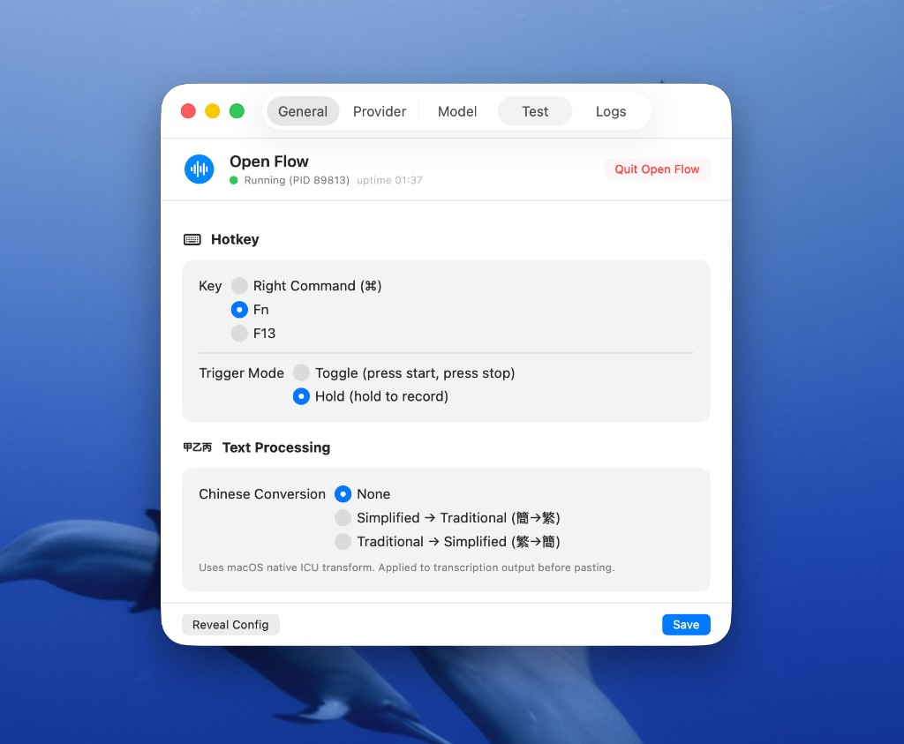

# Open Flow

[简体](README.md) | **繁體** | [English](README.en.md)


**面向 AI 編程場景的開源語音輸入工具。** 按一下鍵錄音，再按一下轉寫並貼上。

---

## 為什麼選 Open Flow

| | Open Flow | Wispr / Typeless / 閃電說 |
| --- | --- | --- |
| **開源** | ✅ MIT，完整程式碼可審計 | ❌ 閉源 |
| **本地模型** | ✅ 語音不離開本機 | 多為雲端 |
| **效能** | ✅ Rust，~5 秒音訊約 83ms 轉寫 | 各異 |
| **可自訂** | ✅ 熱鍵、模型、輸出方式 | 受限 |

我們相信**只有開源才能讓更多人參與**：檢視實作、修改行為、接自己的模型、提交改進。Open Flow 是「熱鍵 → 錄音 → 本地轉寫 → 自動貼上」的開源實作。

---

## 核心亮點

### 🦀 Rust 效能

- **~83ms** 轉寫約 5 秒音訊（M3 Pro 實測）
- 單一二進位、無執行時，**記憶體佔用低**
- 啟動快，適合常駐背景

### 🔓 完全開源

- **MIT 授權**；可審計、可 fork、可修改
- 無廠商鎖定，社群驅動
- 對比閉源產品：[Wispr](https://www.wispr.ai/)、[Typeless](https://typeless.dev/)、[閃電說](https://www.shandianshuo.com/)

### 🔒 本地優先，隱私為重

- **SenseVoiceSmall** 完全在本地執行
- 無需雲端 API，語音不離開你的電腦
- 首次下載模型後，可離線使用（約 230MB）

---

## 功能

- 在 Cursor、VS Code、終端機、瀏覽器中用語音代替打字
- 中英混合，自動標點
- 轉寫結果寫入剪貼簿並自動貼上（macOS 可選 CGEvent 模擬打字），可隨時再次貼上
- 選單列托盤圖示（灰/紅/黃），錄音時可選**浮動指示器**（游標旁「錄音中…」「轉寫中…」）
- 可設定熱鍵（右 Command / Fn / F13）、觸發模式（按一次開關 toggle / 按住錄 hold）、**簡繁轉換**（簡→繁 / 繁→簡）
- 可選本地 SenseVoice 或 **Groq Whisper** 雲端辨識；可切換模型預設（quantized / fp16）
- **macOS**：托盤選單「偏好設定…」開啟 **SwiftUI 設定介面**，圖形化管理熱鍵、Provider、模型、權限與日誌

### 浮動錄音指示器（macOS）

錄音時會在游標附近顯示膠囊形浮層，紅色圓點 +「Recording…」表示正在錄音，轉寫時顯示「轉寫中…」，不擋滑鼠操作。


---

## 設定介面（macOS）

從托盤選單點擊 **「偏好設定…」** 可開啟圖形化設定視窗，無需改 config 檔案即可管理以下內容。



| 分頁 | 功能 |
|------|------|
| **一般** | 熱鍵（右 Command / Fn / F13）、觸發模式（Toggle / Hold）、簡繁轉換（無 / 簡→繁 / 繁→簡）、macOS 權限狀態與「開啟設定」跳轉 |
| **Provider** | 本地 / Groq 切換、Groq API Key、Whisper 模型與語言、儲存並套用 |
| **模型** | 模型狀態、下載/重新下載、路徑顯示 |
| **測試** | 即時熱鍵事件監聽，驗證按鍵是否被偵測 |
| **日誌** | 檢視 daemon 最近約 100 行日誌 |

視窗頂部顯示 **daemon 狀態**（執行中 PID、執行時間），並提供 **Start / Stop / Restart / Quit Open Flow** 等控制。權限項目會顯示是否已授權（綠色勾）或可點擊跳轉系統設定。修改後點擊 **Save** 儲存；部分項目需重新啟動 daemon 後生效。

---

## 平台支援

| 平台 | 安裝方式 | 托盤圖示 | 自動貼上 |
| --- | --- | --- | --- |
| macOS Apple Silicon（M1/M2/M3） | 一鍵安裝 / .app 下載 | ✅ | ✅ osascript |
| macOS Intel | 從原始碼建置 | ✅ | ✅ osascript |
| Linux（X11） | 從原始碼建置 | — | ✅ xdotool |
| Linux（Wayland） | 從原始碼建置 | — | ✅ wtype |
| Windows | 從原始碼建置 / Releases 下載 | — | 剪貼簿（需手動 Ctrl+V） |

---

## 快速開始

### macOS

```bash
# 一鍵安裝（Apple Silicon 預編譯套件，首次自動下載 ~230MB 模型）
curl -sSL https://raw.githubusercontent.com/jqlong17/open-flow/master/install.sh | sh

# 啟動（背景執行，可隨時關閉終端機）
open-flow start
```

首次執行會從 Hugging Face 依目前預設自動下載模型（預設 quantized）。支援兩種預設，**首次使用對應預設時都會自動下載**：

- **quantized**（預設）：~230MB，體積小
- **fp16**：~450MB，更高精度，來自 [ruska1117/SenseVoiceSmall-onnx-fp16](https://huggingface.co/ruska1117/SenseVoiceSmall-onnx-fp16)，需手動切換

切換為高精度：`open-flow model use fp16`（若未下載會先自動拉取）；列出預設：`open-flow model list`。選單列灰色圓點即就緒，按右側 Command 錄音，再按一次轉寫並貼上。

**或下載 .app**（雙擊即執行）：[Releases](https://github.com/jqlong17/open-flow/releases) 頁面下載 `Open-Flow-<版本>-macos-aarch64.app.zip`，解壓縮後將 **Open Flow.app** 拖入「應用程式」。執行後點擊選單列托盤圖示，選擇 **「偏好設定…」** 即可開啟圖形化設定介面（熱鍵、Provider、模型、權限、日誌等）。

### Linux

Linux 版支援 **系統托盤**（通知區域圖示顯示待機/錄音/轉寫狀態，右鍵可結束；需安裝 libappindicator）。可選：一鍵安裝預編譯套件，或從原始碼建置。

**一鍵安裝（預編譯，x86_64）**

在終端機執行（下載並解壓至 `~/.local/bin`，並寫入 PATH）：

```bash
mkdir -p ~/.local/bin && curl -sSL https://github.com/jqlong17/open-flow/releases/latest/download/open-flow-x86_64-unknown-linux-gnu.tar.gz | tar -xzf - -C ~/.local/bin && chmod +x ~/.local/bin/open-flow && (grep -q '.local/bin' ~/.bashrc 2>/dev/null || echo 'export PATH="$HOME/.local/bin:$PATH"' >> ~/.bashrc) && echo '安裝完成。執行 source ~/.bashrc 或重新開啟終端機，然後執行: open-flow start --foreground'
```

安裝後執行 `open-flow start --foreground`，首次會自動下載 ~230MB 模型。熱鍵為 **右側 Alt 鍵**；貼上需安裝 xdotool（X11）或 wtype（Wayland）。托盤需安裝 libappindicator（見下方從原始碼建置）。

**從原始碼建置**（需先安裝系統依賴與 Rust）

```bash
# Ubuntu / Debian：系統依賴（含托盤：libappindicator）
sudo apt install libasound2-dev xdotool libappindicator3-dev   # 或 libayatana-appindicator3-dev；X11 貼上用 xdotool，Wayland 用 wtype

# 安裝 Rust（已安裝可略過）
curl --proto '=https' --tlsv1.2 -sSf https://sh.rustup.rs | sh && source ~/.cargo/env

# 複製並編譯
git clone https://github.com/jqlong17/open-flow.git && cd open-flow
cargo build --release
sudo cp target/release/open-flow /usr/local/bin/
```

> **注意**：Linux 上全域熱鍵監聽需要讀取輸入裝置權限。如遇權限不足，將目前使用者加入 `input` 群組：`sudo usermod -aG input $USER`（重新登入後生效）。

### Windows

Windows 版支援 **系統托盤**（工作列右側圖示顯示待機/錄音/轉寫狀態，右鍵可結束）。轉寫結果會寫入剪貼簿，需在目標視窗按 **Ctrl+V** 貼上。

**一鍵安裝（PowerShell，預編譯）**

在 **PowerShell** 中執行（下載並解壓至 `%LOCALAPPDATA%\Programs\open-flow`，並加入使用者 PATH）：

```powershell
$url = "https://github.com/jqlong17/open-flow/releases/latest/download/open-flow-x86_64-pc-windows-msvc.zip"; $dir = "$env:LOCALAPPDATA\Programs\open-flow"; New-Item -ItemType Directory -Force -Path $dir | Out-Null; Invoke-WebRequest -Uri $url -OutFile "$dir\open-flow.zip" -UseBasicParsing; Expand-Archive -Path "$dir\open-flow.zip" -DestinationPath $dir -Force; Remove-Item "$dir\open-flow.zip"; $path = [Environment]::GetEnvironmentVariable("Path", "User"); if ($path -notlike "*$dir*") { [Environment]::SetEnvironmentVariable("Path", "$path;$dir", "User"); Write-Host "已將 $dir 加入 PATH。" }; $env:Path = [Environment]::GetEnvironmentVariable("Path", "User") + ";" + [Environment]::GetEnvironmentVariable("Path", "Machine"); Write-Host "安裝完成。本視窗可直接執行: open-flow.exe start --foreground"
```

安裝完成後**目前視窗**即可執行 `open-flow.exe start --foreground`；新開的終端機也會自動辨識指令。首次執行會自動下載約 230MB 模型。熱鍵為 **右側 Alt 鍵**，轉寫結果在剪貼簿，在任意輸入框按 **Ctrl+V** 貼上。

**從原始碼建置**（需先安裝 [Rust](https://rustup.rs/)）

```powershell
git clone https://github.com/jqlong17/open-flow.git
cd open-flow
cargo build --release
# 二進位檔在 target\release\open-flow.exe，可加入 PATH 或複製到常用目錄
```

**常用指令**

| 指令 | 說明 |
|------|------|
| `open-flow.exe start` | 背景啟動 |
| `open-flow.exe start --foreground` | 前景啟動（終端機看日誌，Ctrl+C 停止） |
| `open-flow.exe stop` | 停止背景 daemon |
| `open-flow.exe status` | 檢視狀態 |
| `open-flow.exe transcribe --duration 5` | 單次錄音 5 秒並轉寫 |

> **說明**：Windows 上全域熱鍵（rdev）可能需要**以系統管理員身分執行**才能在某些應用中生效；若無效可改用 `transcribe` 指令做單次錄音轉寫。

---

## macOS 權限設定

Open Flow 需要以下三項系統權限才能正常運作。**首次啟動後請依序在系統設定中手動開啟**，每項授權後需完全結束並重新開啟 App。

前往 **系統設定 → 隱私權與安全性**，依序加入 `Open Flow.app`：

| 權限 | 路徑 | 用途 |
| --- | --- | --- |
| **麥克風** | 隱私權與安全性 → 麥克風 | 錄製語音 |
| **輔助使用** | 隱私權與安全性 → 輔助使用 | 監聽全域熱鍵（右側 Command） |
| **輸入監控** | 隱私權與安全性 → 輸入監控 | 監聽全域熱鍵（右側 Command） |

> **排查提示**：啟動日誌會列印 `🔎 權限診斷`，`Microphone / Accessibility / Input Monitoring` 均為 `true` 即表示授權完整。即時檢視日誌：
> ```bash
> tail -f ~/Library/Application\ Support/com.openflow.open-flow/daemon.log
> ```

**從原始碼建置**（需 [Rust](https://rustup.rs/)）：`git clone https://github.com/jqlong17/open-flow.git && cd open-flow && cargo build --release`（macOS / Linux / Windows 通用）

**macOS 本地打 .app 套件**：`./scripts/build-app.sh` → 產生 `dist/Open Flow.app` 並安裝到 `/Applications/Open Flow.app`（可設定 `OPEN_FLOW_SIGN_IDENTITY` 使用固定簽章身份）

---

## 常用指令

| 指令 | 說明 |
| --- | --- |
| `open-flow start` | 背景啟動（預設，無需保持終端機） |
| `open-flow start --foreground` | 前景啟動（終端機保持，可看日誌） |
| `open-flow stop` | 停止 daemon |
| `open-flow status` | 狀態、PID、日誌路徑 |
| `open-flow setup` | 手動下載模型 |
| `open-flow transcribe --file <wav>` | 轉寫單一音訊檔案 |

**排查熱鍵**：`RUST_LOG=info open-flow start` 可輸出 `[Hotkey]` 日誌，便於確認按鍵與錄音狀態。

**自動化熱鍵測試**：終端機 1 執行 `RUST_LOG=info open-flow start`，終端機 2 執行 `open-flow test-hotkey --cycles 3`，可自動模擬多輪「按 Command 開始 → 等 3s → 按 Command 停止 → 等轉寫」，對照終端機 1 的 `[Hotkey]` 日誌排查問題。

---

## 文件

[docs/ARCHITECTURE.md](docs/ARCHITECTURE.md) — 知識索引與系統架構：平台矩陣、Daemon/CLI/ASR、托盤與熱鍵解耦、設定與發版

---

## 模型資訊與 Hugging Face 位址

兩種預設均從 Hugging Face 拉取，**設定對應預設後首次啟動或執行 `open-flow model use <預設>` 時會自動下載**，無需手動下載。

| 預設 | 說明 | 體積 | Hugging Face |
|------|------|------|--------------|
| **quantized**（預設） | 量化版，體積小 | ~230MB | [haixuantao/SenseVoiceSmall-onnx](https://huggingface.co/haixuantao/SenseVoiceSmall-onnx) |
| **fp16** | 高精度，非量化 | ~450MB | [ruska1117/SenseVoiceSmall-onnx-fp16](https://huggingface.co/ruska1117/SenseVoiceSmall-onnx-fp16) |

切換預設：`open-flow model use fp16`；列出預設：`open-flow model list`。

---

## 參與貢獻

歡迎 fork、提 issue、提交 PR，一起把開源語音輸入體驗做得更好。

---

## License

MIT
